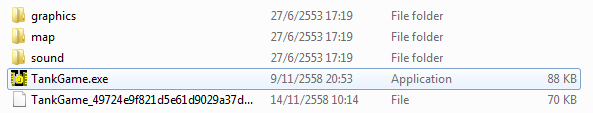
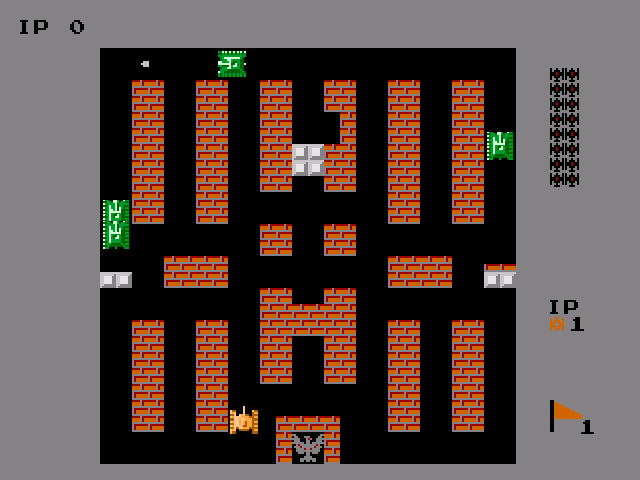
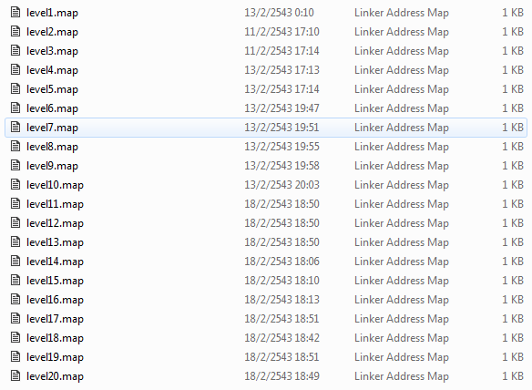
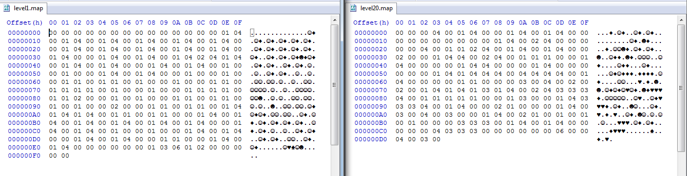
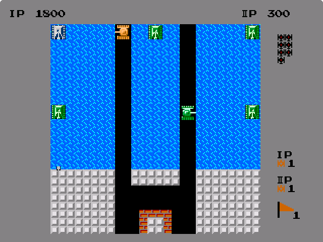

TankGame (REV 200)
=================
By : **PalmPTSJ** (member of **wizard of skn**)

### TH

เป็นโจทย์ reverse engineer 200 คะแนนที่คนทำได้ค่อนข้างเยอะ เลยคิดว่าน่าจะง่าย จึงลองทำดูถึงแม้จะไม่เก่งหมวดนี้ก็ตาม

ไฟล์ที่โหลดมาเป็นไฟล์ zip เมื่อแตกไฟล์ก็จะได้ไฟล์เกมออกมาคือ TankGame.exe พร้อมโฟลเดอร์ graphics map sound ซึ่งก็คือไฟล์เกมนั่นเอง



พอเปิดเกมดู ก็พบว่ามันคือเกม Battle City เมื่อนานมาแล้ว ซึ่งเป็นเกมที่มีเป้าหมายคือให้เรา ซึ่งเป็นรถถัง ไล่ยิงรถถังศัตรูให้หมด โดยไม่ให้ตัวเองโดนยิง และไม่ให้ศัตรูยิงฐานเรา(ข้างล่าง) ได้ ไม่เช่นนั้นจะ Game Over ทันที



เมื่อเปิดดูโฟลเดอร์ map ก็พบว่ามีไฟล์ level1.map ไปจนถึง level20.map แสดงว่ามีทั้งหมด 20 ด่าน และถ้าเล่นจบ ก็น่าจะได้ flag มา ส่วนโฟลเดอร์อื่นๆก็ไม่มีอะไรน่าสนใจ



ตอนนี้สิ่งที่คิดว่าควรจะทำก็คือทำการเปลี่ยนไฟล์ .map ให้กลายเป็นด่านที่เล่นง่ายๆ และก็ลองเล่นให้ครบ 20 ด่าน ก็น่าจะผ่านได้ ดังนั้น ก็เริ่มขั้นตอนแรกคือศึกษาไฟล์ .map เพื่อจะเปลี่ยนให้เป็นด่านที่เล่นง่ายๆ หลักจากใช้ Hex editor เปิดขึ้นมา ก็พอจะเดาได้ว่าเลขอะไรเป็น block ชนิดไหน แต่ว่าแต่ละไฟล์ขนาดไม่เท่ากัน แสดงว่าต้องมีบาง block ที่ใช้มากกว่า 1 byte



หลังจากลองเปิดเกมและแก้เลขใน hex editor ดูไปมา ก็รู้ว่า

|hex   | block      |
|------|-----------|
|00    | ช่องว่าง     |
|01 XX | กำแพง     |
|02 XX | กำแพงเหล็ก |
|04    | น้ำ        |

โดย XX จะบอกว่าวางตัวแบบไหน เช่น เต็มช่อง ครึ่งบน ครึ่งล่าง หรือเป็นมุมต่างๆ

หลังจากนั้นก็เขียนตัว generate map มาเพื่อความสะดวก โดยจะเปลี่ยนทั้ง 20 map ให้เป็น map ง่ายๆเหมือนกันหมด แต่ทีนี้ map ง่ายควรจะเป็นยังไงดีล่ะ ?

เมื่อลองเปลี่ยนไปเยอะๆแล้ว จะพบว่าถ้าศัตรูเกิดบนน้ำ ศัตรูจะขยับไม่ได้ และจะยิงได้ในทิศทางเดียวคือยิงลง และก็พบว่าศัตรูจะเกิดแค่ 5 ที่ใน map เท่านั้น ดังนั้น map ที่ใช้ก็คือ เป็นกำแพงเหล็กคลุมด้านล่าง และเป็นน้ำไว้ข้างบน เหลือช่องให้รถถังเราเดินไปยิงได้

```python
map = [
[4,4,4,4,0,4,4,4,0,4,4,4,4],
[4,4,4,4,0,4,4,4,0,4,4,4,4],
[4,4,4,4,0,4,4,4,0,4,4,4,4],
[4,4,4,4,0,4,4,4,0,4,4,4,4],
[4,4,4,4,0,4,4,4,0,4,4,4,4],
[4,4,4,4,0,4,4,4,0,4,4,4,4],
[4,4,4,4,0,4,4,4,0,4,4,4,4],
[4,4,4,4,0,4,4,4,0,4,4,4,4],
[4,4,4,4,0,4,4,4,0,4,4,4,4],
[2,2,2,2,0,2,2,2,0,2,2,2,2],
[2,2,2,2,0,0,0,0,0,2,2,2,2],
[2,2,2,2,0,2,2,2,0,2,2,2,2],
[2,2,2,2,0,2,2,2,0,2,2,2,2],
]
for level in range(1,21) :
	f = open("level"+str(level)+".map","w")
	for i in range(13) :
		for j in range(13) :
			if(map[i][j] == 2) : f.write(chr(2)+chr(6)) # full steel block
			if(map[i][j] == 0) : f.write(chr(0)) # air
			if(map[i][j] == 4) : f.write(chr(4)) # water
	f.close()
```

ซึ่งก็จะได้ map หน้าตาแบบนี้ (โหมดเล่น 2 คน จะได้ยิงเร็วๆ)



หลังจากนั้นก็แค่เล่นให้ครบ 20 ด่าน ซึ่งไม่มีอะไรมากนอกจากเสียเวลาเท่านั้น หลังจากที่เล่นไปครึ่งชั่วโมงจนจบ ออกมาจากเกมก็จะเจอไฟล์ flag.txt ซึ่งข้างในก็มี flag อยู่คือ `U_9et_Th3_f1@g_0F_TankGame`

จริงๆสามารถเปลี่ยน map ให้เล่นได้เร็วกว่านี้ หรืออาจมีวิธีที่แก้ค่าในเกมได้ แต่เนื่องจากทำไม่เป็น จึงทนเล่นเอาเอง 20 ด่าน และก็ได้ flag

### EN

A reverse engineering challenge (200 points) with many solves. Even that We're not good at RE but We think we should give it a try.

After extracting the file we got the TankGame.exe file and 3 folders which should be the game's data.


Open the TankGame.exe and we've met the "Battle City" game which our objective is to destroy the enemy while protecting yourself and your base. Failing to do that will result in a "Game Over" and we will have to start over again.


Let's inspect the game's data, the *map* folder contains files name **level1.map** up to **level20.map** which suggest that the game has 20 levels and after beating them we should get the flag. The other folders don't seem to have anything interesting.


Now We think that we should change the map to be easier and just beat all of them. After inspecting the .map file with hex editor, We found that the map size are not equal to each other. Maybe some blocks need more than 1 byte?


After some trial and error, I came to a conclusion that

|hex   | block      |
|------|-----------|
|00    | air (empty)     |
|01 XX | brick wall     |
|02 XX | steel wall |
|04    | water       |

The XX byte tells the orientation of the block (full / half-bottom / half-top / corners)

Now it's time to generate our map with a simple script. But what map is considered **easy** ??

After some more trial and error, We found out that the enemy can only spawn in the specific 5 blocks and if they spawn on water, they can't move and will only shoot downwards. So this is the map generating script I used : 

```python
map = [
[4,4,4,4,0,4,4,4,0,4,4,4,4],
[4,4,4,4,0,4,4,4,0,4,4,4,4],
[4,4,4,4,0,4,4,4,0,4,4,4,4],
[4,4,4,4,0,4,4,4,0,4,4,4,4],
[4,4,4,4,0,4,4,4,0,4,4,4,4],
[4,4,4,4,0,4,4,4,0,4,4,4,4],
[4,4,4,4,0,4,4,4,0,4,4,4,4],
[4,4,4,4,0,4,4,4,0,4,4,4,4],
[4,4,4,4,0,4,4,4,0,4,4,4,4],
[2,2,2,2,0,2,2,2,0,2,2,2,2],
[2,2,2,2,0,0,0,0,0,2,2,2,2],
[2,2,2,2,0,2,2,2,0,2,2,2,2],
[2,2,2,2,0,2,2,2,0,2,2,2,2],
]
for level in range(1,21) :
	f = open("level"+str(level)+".map","w")
	for i in range(13) :
		for j in range(13) :
			if(map[i][j] == 2) : f.write(chr(2)+chr(6)) # full steel block
			if(map[i][j] == 0) : f.write(chr(0)) # air
			if(map[i][j] == 4) : f.write(chr(4)) # water
	f.close()
```

Which give us the map like this :


After that we spent about half an hour until we beat the level 20. Then we found the *flag.txt* file in the game's folder which contains the flag : `U_9et_Th3_f1@g_0F_TankGame`
